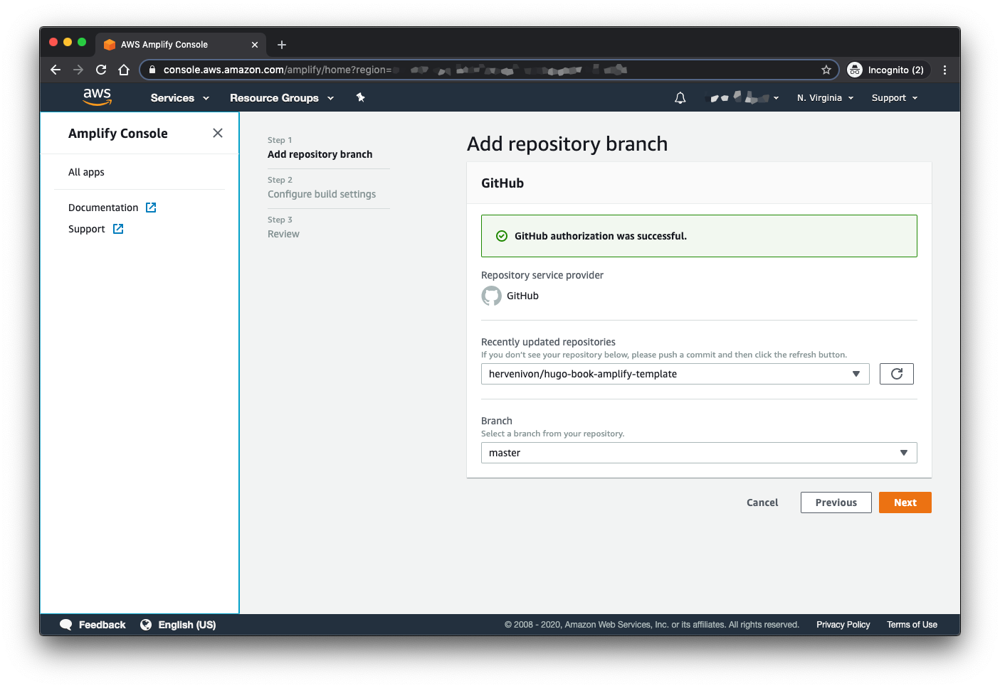
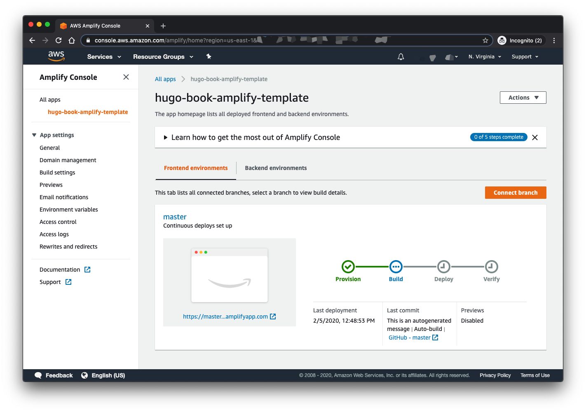
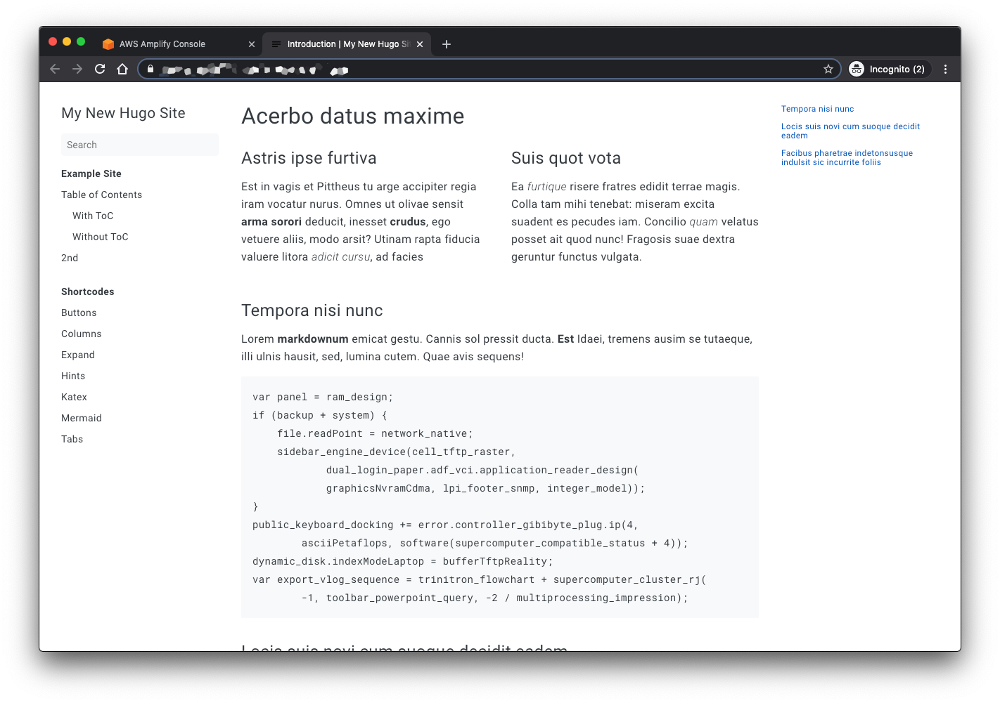
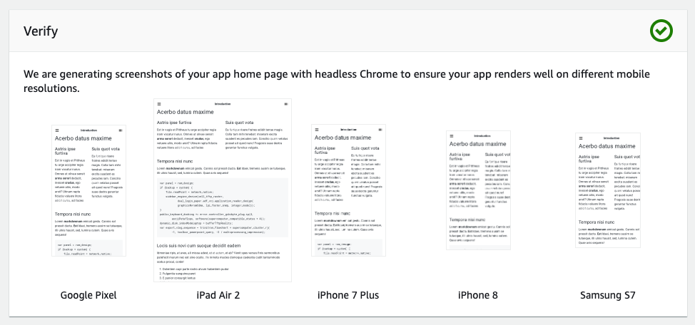

# hugo-book-amplify-template

This repository is the hugo static site generator quickstart with the "Book" template hosted on AWS Amplify.

This repository is based on the following sources:

- [Host on AWS Amplify][hugo-amplify-hosting]
- [Hugo Book theme][hugo-theme-book]
- [Hugo Quickstart][hugo-quickstart]
- [AWS Amplify Console • Getting Started][amplify-getting-started]

## 🏗 Deployment with the AWS Amplify Console

You will use the [AWS Amplify Console][amplify-console] to deploy this static website. The [AWS Amplify Console][amplify-console] will build your static site and provision a place to store and distribute it globally. [AWS Amplify Console][amplify-console] also provides helpful capabilities to simplify both the web site lifecycle and enforce best practices.

Under the hood, the [AWS Amplify Console][amplify-console] leverages [Amazon S3 static hosting][s3-static-hosting] and [Amazon CloudFront][amazon-cloudfront] to distribute your assets. The [AWS Amplify Console][amplify-console] automatically handle cache invalidation each time you push a new version of your web site to your repository.

✅ Step by steps instructions:

1. Launch the [The AWS Amplify Console dashboard][amplify-console-dashboard]
1. Click **Get Started** under Deploy with Amplify Console
1. Select the *Repository service provider* used today and select **Next**
    - As this repository is on GitHub, and you have likely forked it, you'll need to authorize AWS Amplify to access your GitHub account
1. From the dropdown select the *Repository* and *Branch* of your fork

    
1. On the "Configure build settings" page leave all the defaults and select **Next**
1. On the "Review" page select **Save and deploy**

    The process takes a couple of minutes for Amplify Console to create the necessary resources and to deploy your code.

    

Once completed, click on the site image to open your static site in your browser.

If you click on the link for *Master* you'll see various pieces of information about your website deployment, including sample renderings on various platforms:

## ⭐️ Conclusion

💡 [AWS Amplify Console][amplify-console] makes it really easy to deploy static websites following a continuous integration and delivery model. The AWS Amplify Console also has capabilities to build full stack serverless applications. To discover it, you can deploy one of the [Fullstack serverless example projects][amplify-getting-started], in a couple of minutes, you'll fork and get a fully working operational CI/CD serverless web application, give it a try 😉.

## 🤝 Participate

If you have any suggestion, or want more details, do not hesitate to reach out!

[amazon-cloudfront]: https://aws.amazon.com/cloudfront/
[amplify-console]: https://aws.amazon.com/amplify/console/
[amplify-console-dashboard]: https://console.aws.amazon.com/amplify/home
[amplify-getting-started]: https://aws.amazon.com/amplify/console/getting-started/
[hugo-amplify-hosting]: https://gohugo.io/hosting-and-deployment/hosting-on-aws-amplify/
[hugo-quickstart]: https://gohugo.io/getting-started/quick-start/
[hugo-theme-book]: https://themes.gohugo.io/hugo-book/
[s3-static-hosting]: https://docs.aws.amazon.com/AmazonS3/latest/dev/WebsiteHosting.html